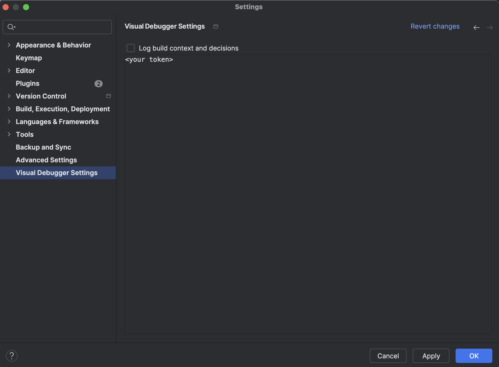
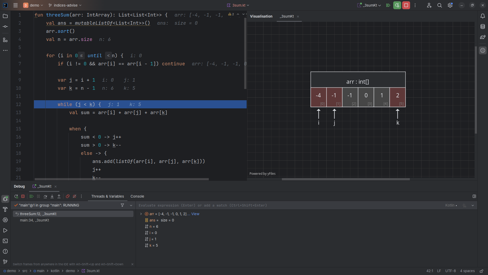
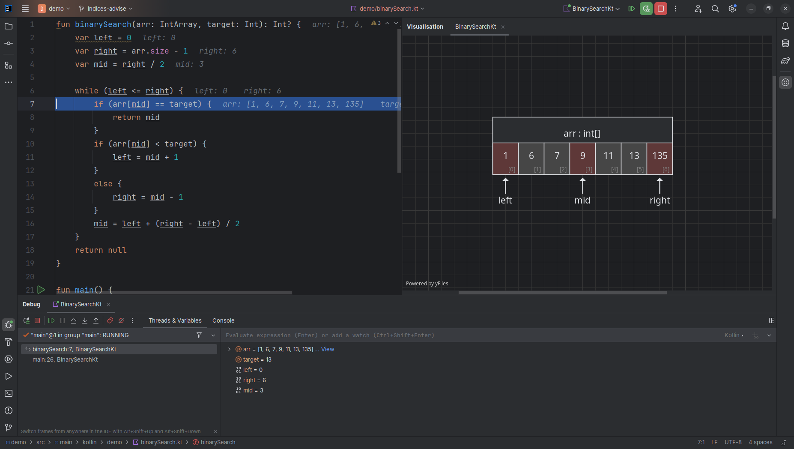
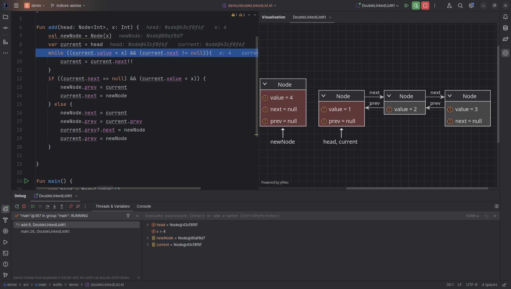
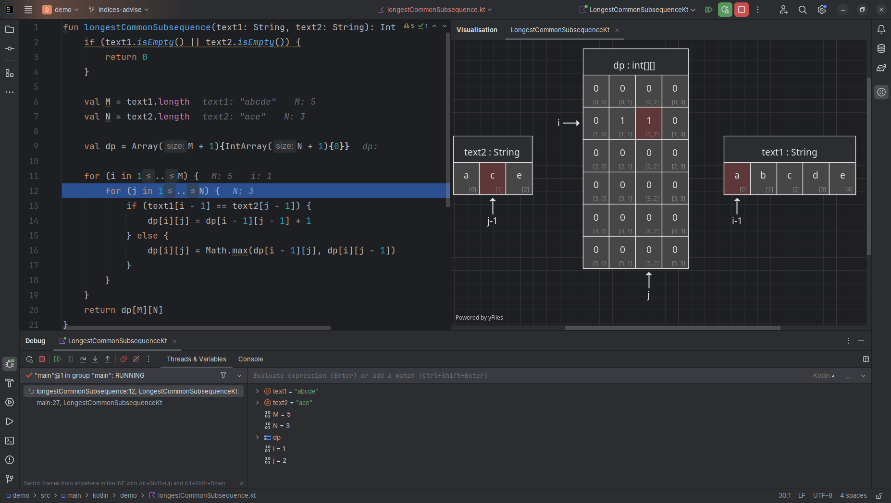
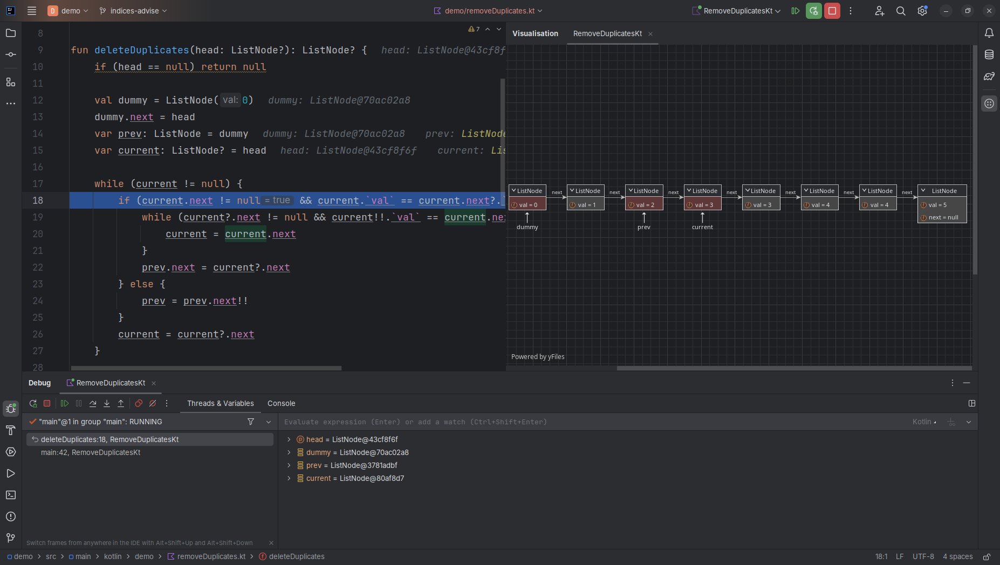
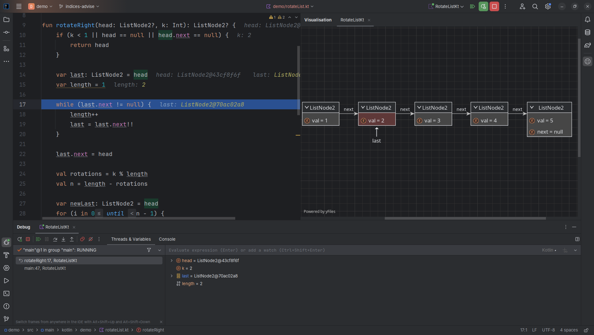
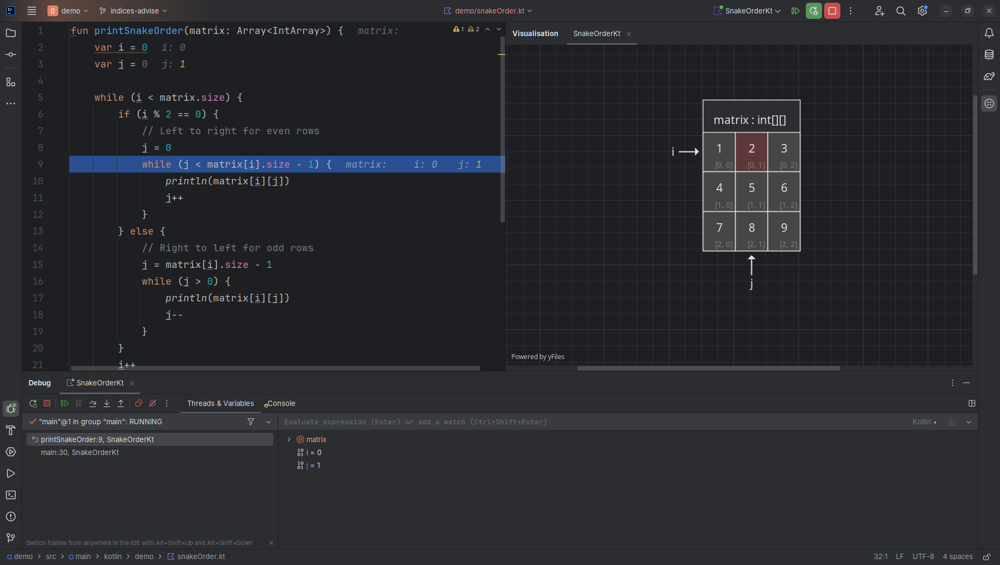

# Visual Debugger - Demo Project

## Introduction

**Visual Debugger** is a powerful plugin for IntelliJ IDEA that enhances the debugging experience by visualizing data structures such as arrays, linked lists, and trees in real-time. It provides a clear, textbook-style representation of your data, making it easier to understand the logic and flow of your code. Key features include:

- Highlighting critical elements like indices of array cells and references to displayed objects.
- Integration with Large Language Models (LLMs) to interpret code semantics and determine what to display and how.

This plugin is especially useful for developers who want to gain deeper insights into their code during debugging sessions.

---

## Installation Instructions

### Step 1: Install the Visual Debugger Plugin
1. Add the following URL to your **Plugin Repositories**:  
   `https://plugins.jetbrains.com/plugins/eap/list`. 
2. Ensure you are using IntelliJ IDEA version **2024.2 or later**.
3. Install the **Visual Debugger** plugin from the [JetBrains Plugin Repository](https://plugins.jetbrains.com/plugin/25314-visual-debugger).

---

### Step 2: Configure Grazie Token
1. After installing the plugin, navigate to the **IDE Settings**.
2. Locate the `Grazie Token` field in the plugin settings:
   

   
Click to expand screenshot

   

   

3. Insert your **Grazie Token** into the field.

#### How to Obtain a Grazie Token:
- Submit a request using [this template](https://youtrack.jetbrains.com/newIssue?project=JBAI&summary=Application+token+for+%7Bplease+indicate+the+project+name%7D&description=%23%23%23+Description%3A%0A%0A*%7BPlease+briefly+describe+the+purpose+of+your+project%7D*%0A%0A%23%23%23+Amount+of+money%3A%0A%0A*%7BPlease+add+information+for+what+amount+of+money+the+token+should+be%7D*%0A%0A%23%23%23+Environment+and+time+limit%3A%0A%0A*%7BPlease+indicate+for+what+period+of+time+the+token+is+needed+and+for+what+environment+the+token+requires+stgn%2Fprod%7D*%0A%0A%23%23%23+&c=add+Board+JBAI+QA+2024+Q2&c=Complexity+S&c=Type+Task&c=Subsystem+Backend&c=Assignee+nikolai.baranko).
- Fill in the necessary details, including the purpose of your project, requested token duration, and environment requirements.

---

### Step 3: Run Examples in Debug Mode
Once the plugin is configured, you can explore the included examples by running them in debug mode.

---

## Examples

The plugin includes several examples to demonstrate its functionality. Each example comes with a demonstration video for better understanding:

1. **3Sum**  
   
   

   
Click to expand the demo video

   <video width="100%" controls>
      <source src="src/main/resources/3sum.mp4" type="video/mp4">
   </video>
   

2. **Binary Search**  
   
   

   
Click to expand the demo video

   <video width="100%" controls>
      <source src="src/main/resources/binarySearch.mp4" type="video/mp4">
   </video>
   

3. **Double Linked List**  
   
   

   
Click to expand the demo video

   <video width="100%" controls>
      <source src="src/main/resources/doubleLinkedList.mp4" type="video/mp4">
   </video>
   

4. **Longest Common Subsequence**  
   
   

   
Click to expand the demo video

   <video width="100%" controls>
      <source src="src/main/resources/longestCommonSubsequence.mp4" type="video/mp4">
   </video>
   

5. **Remove Duplicates**  
    
   

   
Click to expand the demo video

   <video width="100%" controls>
      <source src="src/main/resources/removeDuplicates.mp4" type="video/mp4">
   </video>
   

6. **Rotate List**  
   
   

   
Click to expand the demo video

   <video width="100%" controls>
      <source src="src/main/resources/rotateList.mp4" type="video/mp4">
   </video>
   

7. **Snake Order**  
   
   

   
Click to expand the demo video

   <video width="100%" controls>
      <source src="src/main/resources/snakeOrder.mp4" type="video/mp4">
   </video>
   

---

For further questions or support, feel free to reach out to Grigorii Emdin or Nikita Koval.